# System Architecture

The **AI Circular Economy Marketplace** is architected as a modular, decoupled, and highly scalable platform consisting of a high-performance FastAPI backend, scikit-learn/PyTorch ML microservices, a responsive React/Tailwind frontend, and an ACID-compliant relational persistence layer.

---

## Architectural Diagram

```mermaid
graph TD
    subgraph Client Layer
        Web[React 18 + Vite SPA]
        PublicUI[Public Marketplace / Auth]
        SellerUI[Seller Portal & AI Studio]
        BuyerUI[Buyer Portal & Sourcing]
        AdminUI[Admin Control & ML Registry]
    end

    subgraph API Gateway & Security
        FastAPI[FastAPI Application Server]
        AuthRouter[JWT Authentication & RBAC]
        CORSMiddleware[CORS & Security Headers]
    end

    subgraph Business Logic Services
        MatService[Materials & Listings Service]
        OfferService[Offer & Multi-Round Negotiation Service]
        TxnService[Transaction Lifecycle & Pickup Logistics]
        ChatService[In-Platform Transaction Chat Service]
        MatchService[Haversine Geospatial Matching Engine]
        RecService[Weighted Multi-Factor Recommender]
        SustService[Sustainability & CO₂ Avoidance Engine]
    end

    subgraph AI / ML Subsystem
        VisionModel[MobileNetV2 Material Image Classifier]
        PriceModel[Gradient Boosting Price Range Regressor]
        DemandModel[Gradient Boosting Demand Forecaster]
        Pipeline[Leakage-Free Preprocessing Pipelines]
    end

    subgraph Persistence Layer
        DB[(PostgreSQL / SQLite with SQLAlchemy ORM)]
        Uploads[(File Storage / Uploads)]
        Models[(Joblib Model Artifacts & Metadata)]
    end

    Web --> FastAPI
    FastAPI --> AuthRouter
    FastAPI --> MatService
    FastAPI --> OfferService
    FastAPI --> TxnService
    FastAPI --> ChatService
    FastAPI --> MatchService
    FastAPI --> RecService
    FastAPI --> SustService

    MatService --> VisionModel
    MatService --> PriceModel
    OfferService --> SustService
    RecService --> MatchService
    RecService --> DemandModel

    VisionModel --> Models
    PriceModel --> Models
    DemandModel --> Models

    MatService --> DB
    OfferService --> DB
    TxnService --> DB
    ChatService --> DB
    FastAPI --> Uploads
```

---

## Component Responsibilities

### 1. Presentation Layer (Frontend)
- **Framework**: React 18, Vite, Tailwind CSS, Lucide Icons, Recharts.
- **State & Auth**: `AuthContext` with JWT storage and automated interceptors.
- **Portals**:
  - **Public**: Home, About, Filterable Marketplace, Login, Role-specific Registration.
  - **Seller**: Material Studio with AI upload, My Inventory, Incoming Offers & Countering, Match Finder, Transactions.
  - **Buyer**: Geospatial Sourcing, Sourcing Requirements, Bids & Negotiations, Recommended Lots, Purchased Batches & Inbound Logistics.
  - **Admin**: User management, Inventory controls, Marketplace analytics, ML performance metrics registry.

### 2. Application Layer (Backend)
- **Framework**: FastAPI (Python 3.11).
- **Security**: OAuth2 Bearer with JWT (`HS256`), salted bcrypt password hashing (`passlib`), role-based endpoint guards (`require_role`).
- **Database Access**: SQLAlchemy 2.0 ORM with relational foreign-key cascades and transactional integrity.

### 3. Machine Learning Microservices
- **Material Classification**: Transfer learning MobileNetV2 architecture with color/texture heuristics fallback.
- **Price Range Estimation**: Gradient Boosting Regressor trained with leakage-free cross-validation ($R^2 > 0.99$, MAE $< 2.50$). Computes advisory market ranges with human pricing disclaimers.
- **Demand Forecasting**: Time-series and seasonal demand forecaster ($R^2 \approx 0.81$).
- **Matching & Recommendation**: 5-factor weighted engine combining Haversine geospatial proximity, quality grading, volume compatibility, price alignment, and category overlap.

### 4. Persistence Layer
- **Relational Tables**: `users`, `materials`, `listings`, `buyer_requirements`, `offers`, `offer_history`, `transactions`, `chat_messages`, `sustainability_impacts`, `material_categories`.
- **File System**: Material inspection uploads in `uploads/materials/`.
- **ML Artifacts**: Versioned `.joblib` models and metadata `.json` files in `ml/models/`.
