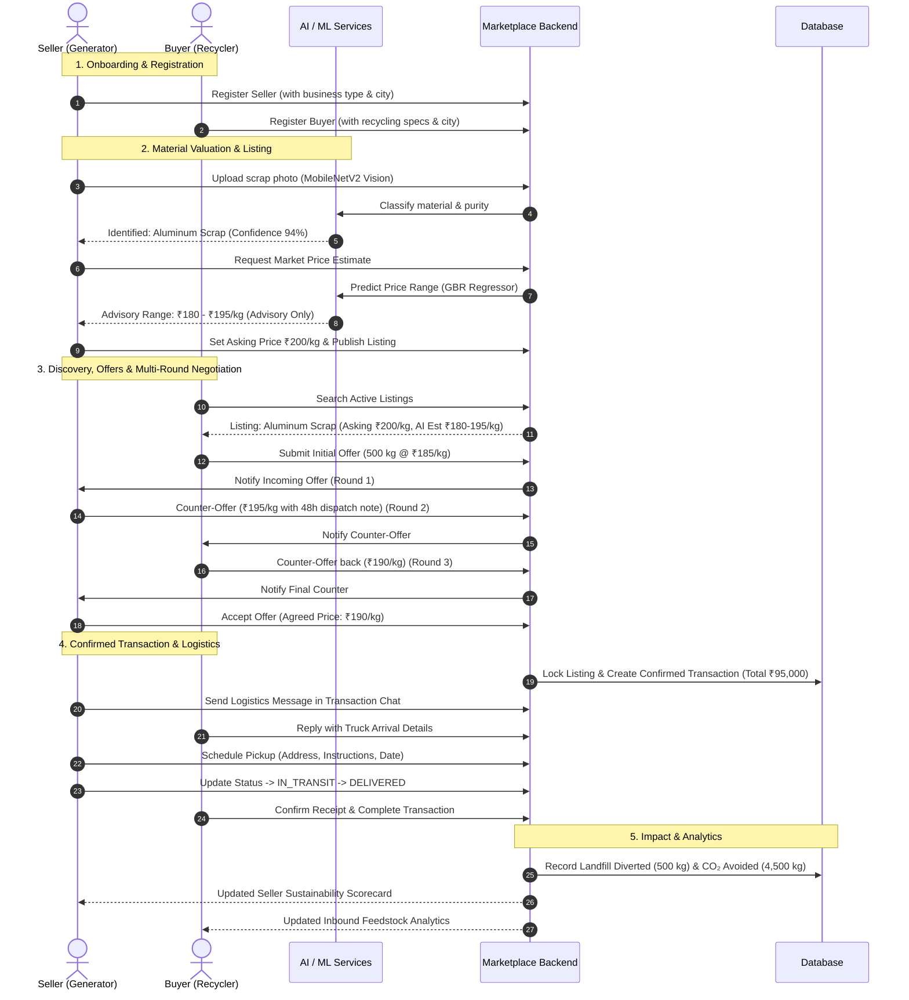

# End-to-End Marketplace Flow

This document details the complete 23-step lifecycle and interaction model of the **AI Circular Economy Marketplace**, linking industrial waste generators (Sellers) with recyclers and re-processors (Buyers).

---

## Complete 23-Step Journey

---

## Step-by-Step Breakdown

| Step | Action | Actor / Component | Output / Result |
|---|---|---|---|
| **1** | Register Seller | Seller | JWT token, organization profile, city/state |
| **2** | Seller Authentication | Seller | Secure session initialized |
| **3** | Image Upload & Computer Vision | ML Classifier | Automatic category & alloy identification |
| **4** | Vision Confirmation | Seller / System | Verified Material Category |
| **5** | AI Price Prediction | ML Price Regressor | Advisory price range (Min/Max benchmark) |
| **6** | Manual Asking Price Setup | Seller | Seller sets independent `asking_price` (e.g. ₹200/kg) |
| **7** | Register Buyer | Buyer | Buyer profile with interested material categories |
| **8** | Buyer Authentication | Buyer | Secure session initialized |
| **9** | Material Search / Filter | Buyer | Query by category, purity, location, distance |
| **10** | Material Discovery | Buyer | View lot details, seller asking price, AI range |
| **11** | Initial Offer Creation | Buyer | `POST /api/offers` (500 kg @ ₹185/kg) |
| **12** | Seller Offer Review | Seller | View offer metrics, margin diff, AI estimate |
| **13** | Seller Counter-Offer | Seller | `POST /api/offers/{id}/counter` (₹195/kg) |
| **14** | Buyer Counter-Offer | Buyer | `POST /api/offers/{id}/counter` (₹190/kg) |
| **15** | Human Acceptance | Seller | `POST /api/offers/{id}/accept` (Agreed: ₹190/kg) |
| **16** | Confirmed Transaction Creation | System | Status: `CONFIRMED`, Total: ₹95,000 |
| **17** | Inventory Update | System | Listing stock updated/depleted to `sold` |
| **18** | Transaction Order View | Both | Access confirmed transaction record |
| **19** | Logistics Chat Initiation | Seller / Buyer | `POST /api/transactions/{id}/messages` |
| **20** | Logistics Chat Exchange | Buyer / Seller | Coordinate gate access and truck registration |
| **21** | Schedule Pickup | Seller | `POST /api/transactions/{id}/schedule-pickup` |
| **22** | Delivery Confirmation | Buyer | `POST /api/transactions/{id}/complete` |
| **23** | Sustainability & Analytics Record | Sustainability Service | Avoided CO₂, diverted landfill mass, carbon certificate |

---

## Price Separation Guarantee

The marketplace strictly isolates AI advisory price estimates from contractual human agreement:

1. **`ai_estimated_min_price` & `ai_estimated_max_price`**: Computed from historical scrap transactions, distance, and condition; advisory reference only.
2. **`asking_price`**: Set exclusively by the seller.
3. **`offered_price`**: Submitted by the buyer during bidding and negotiation rounds.
4. **`agreed_price`**: Recorded solely upon explicit human acceptance.
