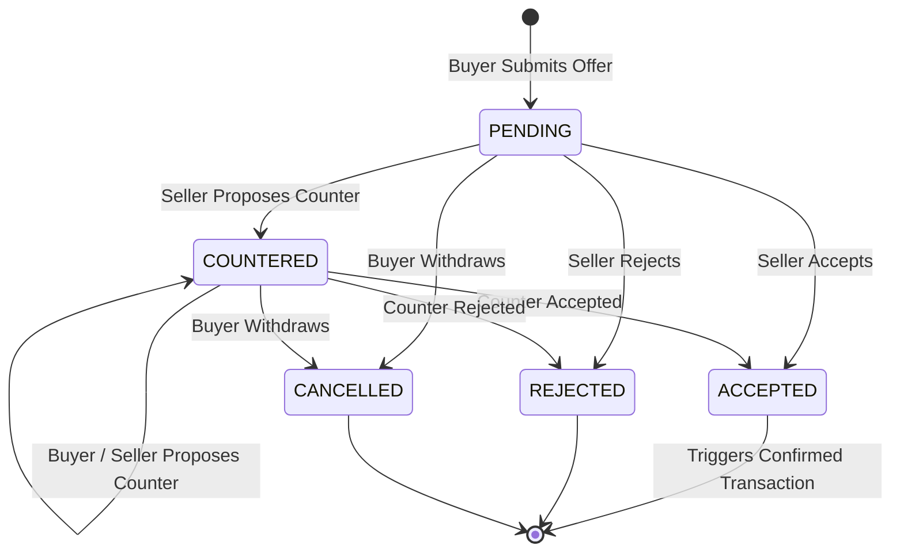

# Multi-Round Offer & Negotiation System

The negotiation subsystem enables transparent, multi-round price and quantity negotiations between industrial sellers and verified buyers while maintaining an immutable audit log.

---

## Core Negotiation Principles

1. **AI is Advisory Only**: The AI models recommend a market valuation range ($[\text{Min}, \text{Max}]$), but never enforce or dictate contractual terms.
2. **Seller Autonomy**: The seller sets the initial `asking_price` and optional `min_acceptable_price`.
3. **Buyer Bidding**: The buyer submits an initial `offered_price` and `offered_quantity`.
4. **Multi-Round Countering**: Both parties can propose counter-prices and logistical terms over sequential rounds until agreement or withdrawal.
5. **Human Acceptance**: A deal is finalized only when one party explicitly accepts the other's proposal, creating a binding `Transaction` with `agreed_price`.

---

## State Transition Diagram



---

## API Endpoints

### 1. Submit Initial Offer
`POST /api/offers`

**Payload:**
```json
{
  "listing_id": "listing-uuid",
  "offered_quantity": 500.0,
  "offered_price": 185.0,
  "message": "We can purchase the full batch with prompt payment."
}
```

### 2. Submit Counter-Offer
`POST /api/offers/{id}/counter`

**Payload:**
```json
{
  "counter_price": 195.0,
  "message": "Can supply at ₹195/kg if pickup is within 48 hours."
}
```

### 3. Accept Offer
`POST /api/offers/{id}/accept`

Automatically locks the agreed price, deducts available listing inventory, and creates a confirmed `Transaction`.

### 4. Reject / Cancel Offer
- `POST /api/offers/{id}/reject`: Seller rejects offer with optional reason.
- `POST /api/offers/{id}/cancel`: Buyer withdraws offer.

### 5. Negotiation Audit Trail
`GET /api/offers/{id}/history`

Returns chronological array of `OfferHistory` records containing `price`, `message`, `action`, `created_by`, and `created_at`.
