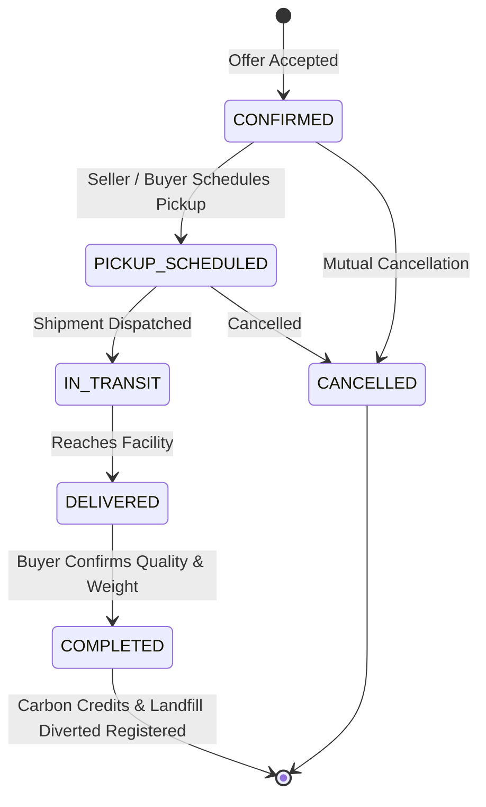

# Transaction Lifecycle, Logistics & Chat

This document describes how confirmed orders transition from price settlement to dispatch, delivery confirmation, transaction-linked chat, and carbon offset accounting.

---

## Transaction Lifecycle States



---

## Key Logistics Endpoints

### 1. Schedule Pickup
`POST /api/transactions/{id}/schedule-pickup`

**Payload:**
```json
{
  "pickup_location": "Plot 42, Sidco Industrial Estate, Coimbatore, Tamil Nadu",
  "pickup_date": "2026-09-25T10:00:00Z",
  "pickup_instructions": "Gate 2 entry. Driver must carry weighbridge slip and photo ID."
}
```

### 2. Update Dispatch Status
`POST /api/transactions/{id}/update-status`

**Payload:**
```json
{
  "status": "IN_TRANSIT"
}
```

### 3. Complete Transaction
`POST /api/transactions/{id}/complete`

Marks transaction as `COMPLETED`, calculates verified sustainability impact metrics, and registers environmental credits.

---

## In-Platform Transaction Chat

Chat is attached exclusively to confirmed transactions, allowing buyers and sellers to safely exchange gate passes, truck plate numbers, weighbridge receipts, and timing updates.

### Endpoints:
- `GET /api/transactions/{id}/messages`: Fetch chronological message thread.
- `POST /api/transactions/{id}/messages`: Send message (`{"message": "Truck arrives at 10 AM"}`).
- `GET /api/chat/conversations`: Fetch user's active transaction chat list with unread indicators.
